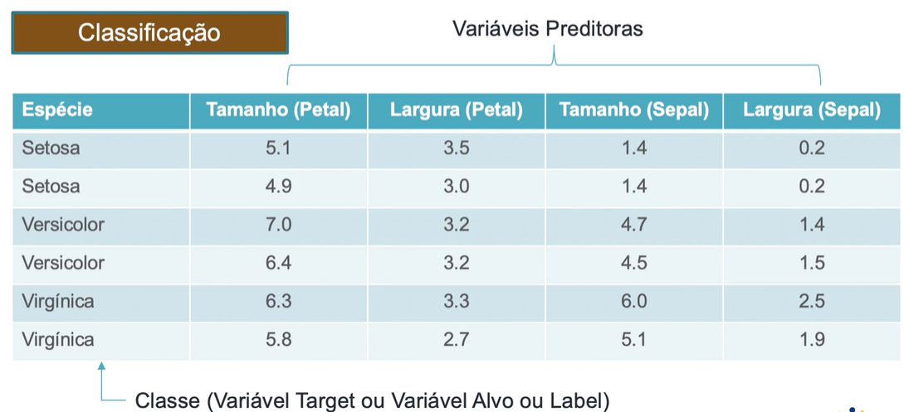
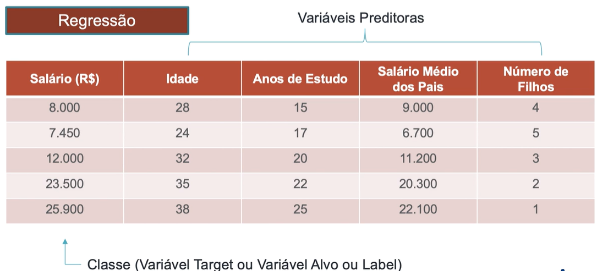

# Machine Learning (DSA)

## Aprendizagem Supervisionada
Quando o programa é treinado sobre um conjunto de dados pré-definido.
Esses algoritmos fazer previsões com base em um conjunto de exemplos.
O algoritmo recebe dados de entrada e saída.
Dentro da aprendizagem supervisionada, temos duas subcategorias:

**Classificação:** Prevê uma classe ou categoria. 
Exemplo de Output: Sim ou Não

**Regressão:** Prevê valor numérico.
Exemplo de Output: Valor de vendas do próximo mês.

### Como Funciona?
Fornecemos ao algoritmo um conjunto de dados de entrada (X) e 
suas respectivas respostas ou rótulos corretos (Y). 
Por exemplo, imagens de gatos com o rótulo "gato".

O algoritmo aprende a mapear as entradas (X) para as saídas (Y) 
ajustando seus parâmetros internos. 
Isso é feito minimizando o erro entre as previsões do modelo e os 
rótulos reais, usando uma métrica de erro (função de perda) e 
métodos de otimização como o gradiente descendente.

## Aprendizagem Não Supervisionada
Quando não temos os dados de saída para um algoritmo, usamos a
Aprendizagem Não Supervisionada. Então, o termo é usado para 
quando um programa pode automaticamente encontrar padrões e relações
em um conjunto de dados.

O algoritmo analisa dados sem rótulos para encontrar padrões, 
estruturas ou agrupamentos (ex. segmentação de clientes).

## Aprendizagem Por Reforço
Similar ao que chamamos de aprender por tentativa e erro.

O agente aprende interagindo com o ambiente, recebendo 
recompensas ou punições, para tomar decisões que maximizem 
ganhos a longo prazo (ex. jogos ou robótica).

## Escolher o Algoritmo Ideal

### Classificação Binária (2 classes)

### Classificação Multiclasse (mais de 2 classes)

### Regressão

### Não Supervisionado

---

## Algoritmos de ML e Modelos Preditivos

### Modelos Descritivos
* Quantos clientes perdemos nos últimos 3 meses?
* As fraudes aumentaram ou diminuíram no último ano?

### Modelos Preditivos
* Quantos clientes podemos conquistar nos próximos 3 meses?
* As fraudes aumentarão ou diminuirão no próximo ano?

Os modelos preditivos são funções matemáticas.

---

## Métodos de Machine Learning

### Instance-Based Learning
É um método que não constroe explicitamente um modelo geral 
durante o treinamento. Em vez disso, eles armazenam os dados de 
treinamento e usam esses exemplos diretamente para fazer 
previsões, comparando novas entradas com as instâncias armazenadas.

**Proximidade:** As previsões são feitas com base na similaridade 
entre a nova entrada e os dados armazenados usando medidas de 
distância.

**Treinamento rápido:** Como apenas armazenam os dados, o 
processo de treinamento é rápido, mas a previsão pode ser lenta, 
pois exige a comparação com múltiplas instâncias.

Esses métodos são úteis em problemas onde os dados têm estruturas 
complexas, mas podem ser sensíveis ao ruído.

Uma grande desvantagem de usar Instance-Based Learning é o alto custo
para a classificação. Toda computação ocorre no momento da classificação.
Ou seja, é praticamente um "de para".

> O dono de uma sorveteria quer recomendar sabores 
para novos clientes com base nos gostos de clientes anteriores.
>
> Ele tem registro dos pedidos anteriores de clientes, como:
> * João gosta de chocolate e morango.
> * Maria gosta de baunilha e morango.
> * Pedro gosta de chocolate.
> 
> Ana entra na loja e diz que gosta de morango.
> 
> Com base no gosto de clientes similares 
> (Maria e João, que também gostam de morango), ele sugere os 
> sabores mais comuns entre eles, como chocolate e baunilha.

No exemplo acima, o cálculo da distância entra no processo de 
comparação da similaridade entre o novo cliente (Ana) e 
os clientes antigos (João, Maria, Pedro).

* João: [1 (chocolate), 0 (baunilha), 1 (morango)]
* Maria: [0, 1, 1]
* Pedro: [1, 0, 0]
* Ana: [0, 0, 1] (só gosta de morango)

Para descobrir quais clientes são mais parecidos com Ana, 
calculamos a "distância" entre as preferências dela e as de cada 
cliente armazenado.

Abaixo há explicações simples sobre alguns dos métodos para 
calcular distância.

**Distância Euclidiana:** Imagine que você quer ir de um ponto 
a outro e pode andar em linha reta, como um pássaro voando. A 
distância Euclidiana mede o trajeto mais curto entre esses dois 
pontos, como se você fosse direto sem precisar virar esquinas.

**Distância de Manhattan:** Agora, imagine que você está em uma 
cidade com ruas em formato de grade e só pode andar reto e virar 
nas esquinas. A distância de Manhattan mede quantos passos você 
dá seguindo as ruas, somando todos os movimentos horizontais e 
verticais.

**Correlação de Pearson:** Pense em duas coisas que podem mudar 
juntas, como a altura e o peso das pessoas. A correlação de 
Pearson mede o quanto essas duas coisas "andam juntas". 
Se pessoas mais altas geralmente pesam mais, a correlação será 
forte; se não houver ligação entre elas, será fraca.

**Similaridade de Cosseno:** Imagine que você está comparando gostos 
ou preferências, como listas de coisas que duas pessoas gostam. 
A similaridade de cosseno mede o quanto essas listas têm em comum, 
ignorando o tamanho das listas. 
> João tem uma lista com 10 coisas, e Maria com 3, mas se ambos 
> gostam de chocolate e morango, os gostos deles são bem parecidos.

**Distância de Edição:** Imagine duas palavras e as mudanças necessárias 
para transformar uma na outra. A distância de edição conta o número de 
mudanças (trocar, remover ou adicionar letras).
> Para transformar "gato" em "rato", basta trocar o "g" por "r".

### Probabilistic Learning

Os métodos probabilísticos em aprendizado de máquina usam conceitos de probabilidade 
para tomar decisões, realizar classificações ou previsões. Eles estimam a 
probabilidade de uma saída pertencer a uma classe ou de um evento ocorrer, 
baseando-se nos padrões encontrados nos dados de treinamento.

Em vez de dar uma resposta definitiva, esses métodos calculam a probabilidade 
de uma entrada pertencer a uma classe específica.

> Para classificar um email como "spam", o modelo pode dizer que ele tem 90% de 
> probabilidade de ser spam e 10% de não ser.

Exemplos de métodos probabilísticos comuns:

**Naive Bayes:** Baseado no Teorema de Bayes e assume que as variáveis 
(ex.: palavras) são independentes. Usado em classificação de texto, como filtro de 
spam ou análise de sentimentos.

**Modelos de Mistura Gaussiana (GMM):** Usa distribuições Gaussianas para modelar 
os dados. Comumente usado para agrupamento (não supervisionado).

**Regressão Logística:** Usa a função logística para calcular a probabilidade de 
uma classe. Usado para classificação binária (ex.: previsão de doenças).

**Hidden Markov Models (HMM):** Modelam dados sequenciais, como reconhecimento 
de fala ou análise de séries temporais.

### Search-Based Learning

É uma abordagem de aprendizado que vê o processo de aprendizado 
como um problema de exploração de um espaço de hipóteses ou soluções. 
Nesse método, a ideia principal é buscar a hipótese 
(modelo ou regra) que melhor se ajusta aos dados de treinamento, 
utilizando técnicas de busca e heurísticas para encontrar essa 
solução.

> Para prever se uma pessoa vai ou não comprar um produto, podemos
> nos basear na sua idade, renda, tempo no site e etc.
 
Um método famoso do Search-Based Learning são as Decision Trees,
que usam estratégias de "dividir para conquistar" para resolver
determinado problema. Um problema complexo é dividido em problemas
mais simples ao quais recursivamente é aplicada a mesma estratégia.

**Árvore de Decisão:** Resolve problemas de classificação.

**Árvore de Regressão:** Resolve problemas de regressão.

**Algoritmos:** ID3 (1986); C4.5 (1993) 

### Optimizario-Based Learning

São técnicas que tratam o processo de aprendizado como um 
problema de otimização, onde o objetivo é encontrar os melhores 
parâmetros ou a melhor solução para um modelo, minimizando ou 
maximizando uma função de erro (ou objetivo).

Os métodos de aprendizado mais comuns nessa categoria são as 
**Redes Neurais Artificiais** e os **SVM (Support Vector Machines)**.

**Ar

